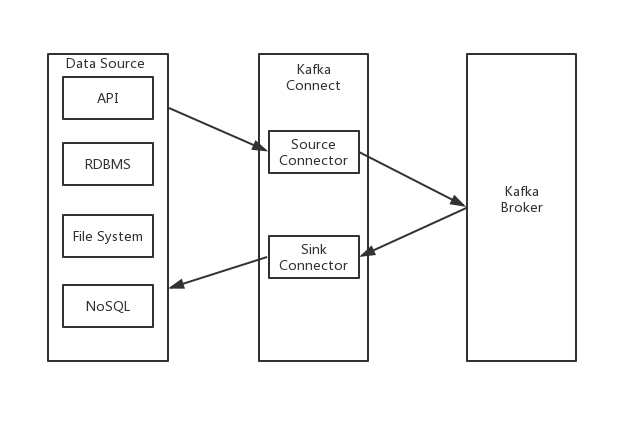

## 本Demo简介
Kafka Connect主要用于将数据流输入和输出Kafka，详细介绍请参见[Kafka官方介绍](https://kafka.apache.org/documentation/#connect)或[Confluent](https://docs.confluent.io/current/connect/index.html)。


Kafka Connect主要通过各种Source Connector的实现，将数据从第三方系统输入到Kafka broker，通过各种Sink Connector实现，将数据从Kafka broker中导入到第三方系统。

本示例主要演示如何启动Kafka Connect，并且在上面跑指定的Connector，其主要流程有：
1. 启动Kafka Connect。
2. 通过Kafka Connect提供的API请求启动指定的Source Connector或Sink Connector。

以下内容主要演示第1步，即如何启动Kafka Connect（可以为单机，也可以为集群）。第2步，即如何在Kafka Connect中运行指定的Connector请根据需求参见各子目录demo。

## 获取Kafka Connect
根据消息队列Kafka服务端版本，下载对应版本[Kafka](http://kafka.apache.org/downloads)。
以0.10.0.0版本为例，下载后解压。
```shell
> tar -xzf kafka_2.11-0.10.0.0.tgz
> cd kafka_2.11-0.10.0.0
```

## 配置Kafka Connect

### VPC内接入配置
编辑配置文件connect-distributed.properties。
```shell
> vim config/connect-distributed.properties
```
下面列出几项重要的配置，更多配置信息可以参见官方[配置详解](https://kafka.apache.org/documentation/#connectconfigs)

```
## Kafka接入点，通过控制台获取
## 您在控制台获取的默认接入点
bootstrap.servers=控制台上的接入点IP+Port

## 同一个集群中的connect使用相同的group.id
## 注意需要提前在控制台创建以该group.id命名的Consumer Group
group.id=connect-cluster

## 用于存储各connectors相关的offset的Compact Topic
## 需要提前在控制台创建，建议Paritition数为48
offset.storage.topic=connect-offsets

## 用于存储connector和task相关的配置的Compact Topic
## 需要提前在控制台创建，Parition数必须设置为1
config.storage.topic=connect-configs

## 用户存储kafka connect状态信息的Compact Topic
## 需要提前在控制台创建，建议Partition数为12
status.storage.topic=connect-status
```

### 公网接入配置
编辑配置文件connect-distributed.properties。
```shell
> vim config/connect-distributed.properties
```
下面列出几项重要的配置，更多配置信息可以参见官方[配置详解](https://kafka.apache.org/documentation/#connectconfigs)

```
## Kafka接入点，通过控制台获取
## 您在控制台获取的SSL接入点
bootstrap.servers=控制台上的接入点IP+Port

## 配置offset.storage.topic、config.storage.topic以及status.storage.topic
## 等Kafka Connect内部配置类topic公网访问信息
ssl.truststore.location=kafka.client.truststore.jks
ssl.truststore.password=KafkaOnsClient
security.protocol=SASL_SSL
sasl.mechanism=PLAIN

## 配置Kafka Source Connectors producer公网访问信息
## Kafka Connector使用该配置的producer发送增量信息到Kafka broker
producer.ssl.truststore.location=kafka.client.truststore.jks
producer.ssl.truststore.password=KafkaOnsClient
producer.security.protocol=SASL_SSL
producer.sasl.mechanism=PLAIN

## 配置Kafka Sink Connectors consumer公网访问信息
## Kafka Connector使用该配置的consumer消费Kafka broker中消息
consumer.ssl.truststore.location=kafka.client.truststore.jks
consumer.ssl.truststore.password=KafkaOnsClient
consumer.security.protocol=SASL_SSL
consumer.sasl.mechanism=PLAIN


## 同一个集群中的connect使用相同的group.id
## 注意需要提前在控制台创建以该group.id命名的Consumer Group
group.id=connect-cluster

## 用于存储各connectors相关的offset的Compact Topic
## 需要提前在控制台创建，建议Paritition数为48
offset.storage.topic=connect-offsets

## 用于存储connector和task相关的配置的Compact Topic
## 需要提前在控制台创建，Parition数必须设置为1
config.storage.topic=connect-configs

## 用户存储kafka connect状态信息的Compact Topic
## 需要提前在控制台创建，建议Partition数为12
status.storage.topic=connect-status
```

编辑kafka_client_jaas.conf文件。
```shell
> vim kafka_client_jaas.conf
```

```
KafkaClient {
   org.apache.kafka.common.security.plain.PlainLoginModule required
   ## 控制台中实例的用户名和密码
   username="your username"
   password="your password";
};

```

## 控制台创建Topic与Consumer Group

需要提前在控制台创建相应Topic以及Consumer Group。

根据本例配置，需要创建的Topic: connect-offsets, connect-configs, connect-status。

根据本例配置，需要创建的Consumer Groups:connect-cluster。

详情参见上一步。


## 启动Kafka Connect
在配置好connect-distributed.properties之后，执行下列命令启动Kafka Connect。
```shell
## 如果是公网接入，先设置java.security.auth.login.config
## VPC接入可以跳过这一步
> export KAFKA_OPTS="-Djava.security.auth.login.config=kafka.client.truststore.jks"

## 启动Kafka Connect
> bin/connect-distributed.sh config/connect-distributed.properties
```