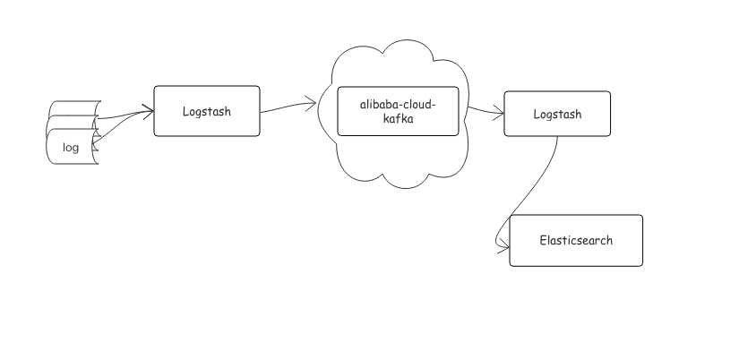

## 前言
以下为使用logstash收集日志文件到阿里云Kafka，然后在通过Logstash从Kafka接收数据经过Filter后到ES的示例，其中示例分类为VPC内示例(内网)和公网SSL示例，可根据购买的实例信息选择相应示例运行。 

## 安装必备
1. Maven 3.2.5+
2. JDK 8+ 
3. Logstash [5.6+](https://www.elastic.co/guide/en/logstash/current/installing-logstash.html#installing-logstash) 
4. Elasticsearch [5.6+](https://www.elastic.co/downloads/elasticsearch)  

## 示例简介
示例以通过Logstash读取日志文件到Kafka的一个主题，然后再通过Logstash从这个主题读取消息，经过配置的Filter之后到ES。

 
1. 读取日志文件数据到阿里云Kafka，文件内容格式可自定义，更多参数设置可参考[plugins-outputs-kafka](https://www.elastic.co/guide/en/logstash/current/plugins-outputs-kafka.html)；
2. 从Kafka消费某个主题数据然后经过Filter后存储到ES，更多参数设置可参考[plugins-inputs-kafka](https://www.elastic.co/guide/en/logstash/current/plugins-inputs-kafka.html)。

## 示例配置

### VPC内示例配置
#### Logstash读取数据到Kafka
请根据以下配置项说明修改对应的XXX。

| demo中配置文件 | 配置项 | 说明 |
| --- | --- | --- |
| logstash_output.conf#input | type| 自定义的类型值 |
| logstash_output.conf#input | path | 文件路径 |
| logstash_output.conf | bootstrap_servers | 请参考文档[获取接入点](https://help.aliyun.com/document_detail/68342.html?spm=a2c4g.11186623.6.554.X2a7Ga) |
| logstash_output.conf | topics | 请参考文档[创建资源](https://help.aliyun.com/document_detail/68328.html?spm=a2c4g.11186623.6.549.xvKAt6) |

#### Logstash从kafka消费数据到es
请根据以下配置项说明修改对应的XXX。

| demo中配置文件 | 配置项 | 说明 |
| --- | --- | --- |
| logstash_input.conf | bootstrap_servers | 请参考文档[获取接入点](https://help.aliyun.com/document_detail/68342.html?spm=a2c4g.11186623.6.554.X2a7Ga) |
| logstash_input.conf | topics | 请参考文档[创建资源](https://help.aliyun.com/document_detail/68328.html?spm=a2c4g.11186623.6.549.xvKAt6) |
| logstash_input.conf | group_id | 请参考文档[创建资源](https://help.aliyun.com/document_detail/68328.html?spm=a2c4g.11186623.6.549.xvKAt6) |
| logstash_input.conf | type | 自定义的类型值 |
| logstash_input.conf | elasticsearch#hosts | es服务地址 |

### SSL示例配置

#### Logstash读取数据到Kafka

请根据以下配置项说明修改对应的XXX。

| demo中配置文件 | 配置项 | 说明 |
| --- | --- | --- |
| jaas.conf | username | 请修改实例详情中的用户名 |
| jaas.conf | password | 请修改实例详情中的密码 |
| logstash_output.conf#input | type| 自定义的类型值 |
| logstash_output.conf#input | path | 文件路径 |
| logstash_output.conf#output | bootstrap_servers | 请参考文档[获取接入点](https://help.aliyun.com/document_detail/68342.html?spm=a2c4g.11186623.6.554.X2a7Ga) |
| logstash_output.conf#output | topics | 请参考文档[创建资源](https://help.aliyun.com/document_detail/68328.html?spm=a2c4g.11186623.6.549.xvKAt6) |
| logstash_output.conf#output | security_protocol | SASL_SSL，无需修改 |
| logstash_output.conf#output | sasl_mechanism | PLAIN，无需修改 |
| logstash_output.conf#output | jaas_path | 请修改成agent/jaas.conf的存放位置 |
| logstash_output.conf#output | ssl_truststore_location | 请修改成agent/kafka.client.truststore.jks存放的位置 |
| logstash_output.conf#output | ssl_truststore_password | KafkaOnsClient，无需修改 |
| logstash_output.conf#output | ssl_endpoint_identification_algorithm | 请根据logstash版本依赖的kafka-client版本进行参数设置 比如6.6.1依赖的kafka-client版本大于2.0.0则需要设置ssl_endpoint_identification_algorithm => "" 依赖的kafka-client版本小于2.0.0可忽略此参数 |

#### Logstash从kafka消费数据到es
请根据以下配置项说明修改对应的XXX。

| demo中配置文件 | 配置项 | 说明 |
| --- | --- | --- |
| jaas.conf | username | 请修改实例详情中的用户名 |
| jaas.conf | password | 请修改实例详情中的密码 |
| logstash_input.conf | bootstrap_servers | 请参考文档[获取接入点](https://help.aliyun.com/document_detail/68342.html?spm=a2c4g.11186623.6.554.X2a7Ga) |
| logstash_input.conf#output | security_protocol | SASL_SSL，无需修改 |
| logstash_input.conf#output | sasl_mechanism | PLAIN，无需修改 |
| logstash_input.conf#output | jaas_path | 请修改成agent/jaas.conf的存放位置 |
| logstash_input.conf#output | ssl_truststore_location | 请修改成agent/kafka.client.truststore.jks存放的位置 |
| logstash_input.conf#output | ssl_truststore_password | KafkaOnsClient，无需修改 |
| logstash_input.conf#output | ssl_endpoint_identification_algorithm | 请根据logstash版本依赖的kafka-client版本进行参数设置 比如6.6.1依赖的kafka-client版本大于2.0.0则需要设置ssl_endpoint_identification_algorithm => "" 依赖的kafka-client版本小于2.0.0可忽略此参数 |
| logstash_input.conf | topics | 请参考文档[创建资源](https://help.aliyun.com/document_detail/68328.html?spm=a2c4g.11186623.6.549.xvKAt6) |
| logstash_input.conf | group_id | 请参考文档[创建资源](https://help.aliyun.com/document_detail/68328.html?spm=a2c4g.11186623.6.549.xvKAt6) |
| logstash_input.conf | type | 自定义的类型值 |
| logstash_input.conf | elasticsearch#hosts | es服务地址 |

### 示例运行
在logstash目录下执行
1. bin/logstash -f logstash-output.conf
2. bin/logstash -f logstash-input.conf
