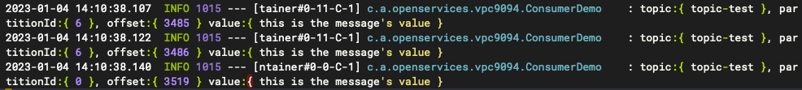

## Run Demo
1. 安装软件：确保安装了 JDK 8+ 和 Maven 3.2.5+
2. 编写配置：SASL接入点 需要修改 application.yml 里面的 bootstrap-servers、 topic 、group、username、password 配置
3. 发送消息：执行 run_demo.sh 后，send_message.sh 即可发送100条消息
4. 消费消息：发送消息后，观察日志输出
5. 
6. 如图类似消费日志，表示消费成功。

	

